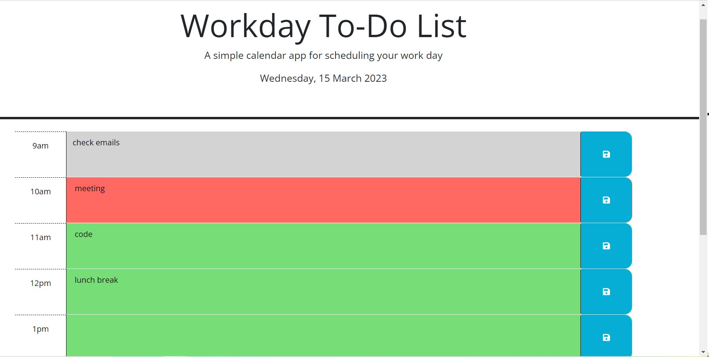

# Workday To-Do List

## Description

I wanted to create a workday calendar to-do list using JQuery and Day.JS. 
It helps keep track of each to-do item with the hour of the day, changing colours to grey (past), red (current), and green (future).

This helped me learn a lot about JQUery syntax and Day.JS

## Installation

N/A

## Usage

When you open the page, you are presented with today's date and 1 hour timeslots from 9am-5pm.
You can press into each box and write down your task for that hour. Once you're done, press the save button on the right. Now your item is saved in local storage! If you referesh the page, your task item will still be there waiting for you, until you delete the text and press save.

Each timeslot is also color coded according to the time you opened the browser. If the hour matches the list's hour timeslot, it will have a red background. If the timeslot is in the past, it will be colored grey. If the timeslot is in the future, it will be colored green.

## License

MIT License

Copyright (c) 2023 zeinahares

Permission is hereby granted, free of charge, to any person obtaining a copy of this software and associated documentation files (the "Software"), to deal in the Software without restriction, including without limitation the rights to use, copy, modify, merge, publish, distribute, sublicense, and/or sell copies of the Software, and to permit persons to whom the Software is furnished to do so, subject to the following conditions:

The above copyright notice and this permission notice shall be included in all copies or substantial portions of the Software.

THE SOFTWARE IS PROVIDED "AS IS", WITHOUT WARRANTY OF ANY KIND, EXPRESS OR IMPLIED, INCLUDING BUT NOT LIMITED TO THE WARRANTIES OF MERCHANTABILITY, FITNESS FOR A PARTICULAR PURPOSE AND NONINFRINGEMENT. IN NO EVENT SHALL THE AUTHORS OR COPYRIGHT HOLDERS BE LIABLE FOR ANY CLAIM, DAMAGES OR OTHER LIABILITY, WHETHER IN AN ACTION OF CONTRACT, TORT OR OTHERWISE, ARISING FROM, OUT OF OR IN CONNECTION WITH THE SOFTWARE OR THE USE OR OTHER DEALINGS IN THE SOFTWARE.